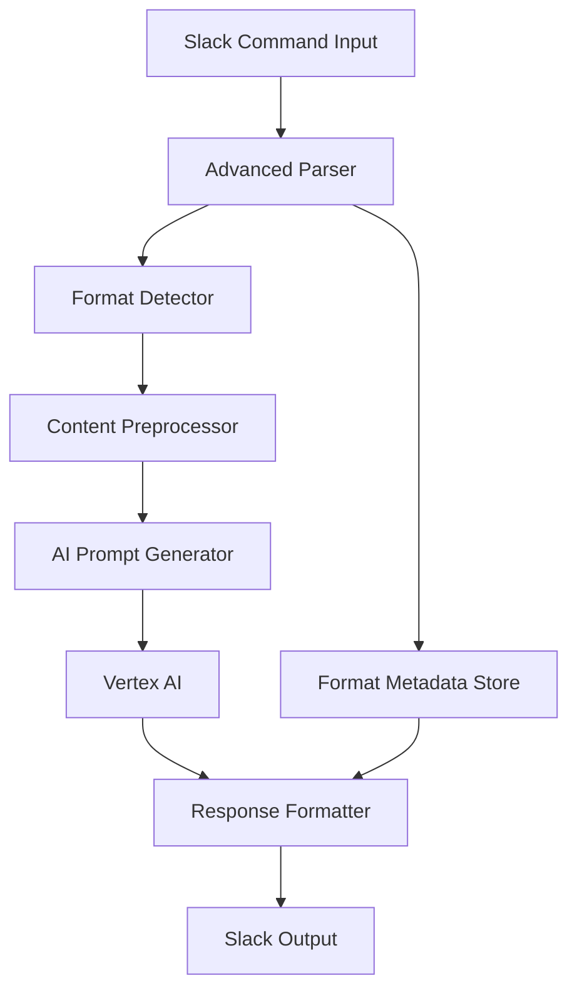

# 서식 보존 시스템 기술 요구사항 문서 (TRD)

**Document ID**: TRD-FORMAT-001  
**Version**: 1.0  
**Date**: 2025-07-20  
**Author**: Claude Code  
**Status**: Draft  

## 목차

1. [개요](#1-개요)
2. [현재 상태 분석](#2-현재-상태-분석)
3. [기능 요구사항](#3-기능-요구사항)
4. [기술 설계](#4-기술-설계)
5. [구현 계획](#5-구현-계획)
6. [테스트 전략](#6-테스트-전략)
7. [성능 고려사항](#7-성능-고려사항)

---

## 1. 개요

### 1.1 목적
Writerly AI Assistant가 사용자 입력의 **원본 서식과 레이아웃을 완벽히 보존**하여 AI 응답에 반영할 수 있도록 시스템을 개선한다.

### 1.2 범위
- Slack 명령어 입력 파싱 개선
- AI 프롬프트 생성 시 서식 보존
- AI 응답의 Slack 포맷팅 최적화
- 다양한 콘텐츠 타입 지원

### 1.3 핵심 목표
- **100% 줄바꿈 보존**: 사용자 의도한 모든 줄바꿈 유지
- **Slack 서식 지원**: 볼드, 이탤릭, 코드블록 등 완전 지원
- **레이아웃 유지**: 리스트, 들여쓰기, 구조화된 텍스트 보존
- **특수문자 안전성**: 모든 유니코드와 특수문자 처리

---

## 2. 현재 상태 분석

### 2.1 현재 시스템 제약사항

#### 2.1.1 입력 파싱 문제
```typescript
// 현재 코드 (simple-oauth-minimal.ts:244-250)
function parseSlashCommand(text: string): { prompt: string | null, data: string | null } {
  const match = text.match(/^"([^"]+)"\s+"(.+)"$/s);
  if (match) {
    return { prompt: match[1], data: match[2] };
  }
  return { prompt: null, data: null };
}
```

**문제점:**
- 간단한 regex로 인한 복잡한 서식 손실
- 중첩된 따옴표 처리 불가
- 줄바꿈 패턴 무시

#### 2.1.2 AI 프롬프트 생성 문제
```typescript
// 현재 코드 (simple-oauth-minimal.ts:358-376)
systemPrompt = `Task: ${prompt}\n\nProvide a clear and concise response.\n\nData: ${data}`;
```

**문제점:**
- 서식 보존 지시 없음
- 단순 텍스트 처리만 고려
- 컨텍스트별 서식 처리 규칙 부재

#### 2.1.3 응답 포맷팅 문제
```typescript
// 현재 코드 (simple-oauth-minimal.ts:408)
await sendUserMessage(channelId, content, userToken);
```

**문제점:**
- 단순 텍스트 전송
- Slack 마크다운 변환 없음
- 구조화된 응답 미지원

### 2.2 서식 손실 유형 분석

| 서식 타입 | 현재 상태 | 손실 정도 | 우선순위 |
|-----------|-----------|-----------|----------|
| 줄바꿈 | ❌ 손실 | 높음 | P0 |
| **볼드** (`*text*`) | ❌ 손실 | 중간 | P1 |
| _이탤릭_ (`_text_`) | ❌ 손실 | 중간 | P1 |
| `코드` (`` `text` ``) | ❌ 손실 | 높음 | P0 |
| 링크 (`<url\|text>`) | ❌ 손실 | 중간 | P1 |
| 리스트 구조 | ❌ 손실 | 높음 | P0 |
| 들여쓰기 | ❌ 손실 | 낮음 | P2 |

---

## 3. 기능 요구사항

### 3.1 입력 처리 요구사항

#### FR-001: 고급 명령어 파싱
- **설명**: 복잡한 서식이 포함된 명령어 정확 파싱
- **입력 형식**: `/ai "작업설명" "서식이 포함된 긴 텍스트"`
- **지원 서식**: 모든 Slack mrkdwn 형식
- **우선순위**: P0

#### FR-002: 멀티라인 텍스트 지원
- **설명**: 줄바꿈, 단락, 리스트 구조 완벽 보존
- **예시**:
  ```
  /ai "정리" "프로젝트 현황:
  
  1. *완료된 작업*
     - UI 디자인 ✅
     - API 연동 ✅
  
  2. _진행 중인 작업_
     - 테스트 코드 작성
     - 문서화
  
  3. **남은 작업**
     - 배포 준비
     - 성능 최적화"
  ```
- **우선순위**: P0

#### FR-003: 특수문자 및 이모지 지원
- **설명**: 유니코드, 이모지, 특수기호 완전 지원
- **테스트 케이스**: `✅ 📋 🔥 → ← ↑ ↓ ♦ ♠ ♣ ♥`
- **우선순위**: P1

### 3.2 AI 처리 요구사항

#### FR-004: 서식 인식 AI 프롬프트
- **설명**: AI가 서식의 의미와 구조를 이해하도록 지시
- **프롬프트 전략**:
  ```
  You are processing formatted text from Slack. Preserve ALL original formatting:
  - Line breaks represent intentional structure
  - *bold* text indicates emphasis
  - _italic_ text shows secondary emphasis
  - `code` text must remain as code
  - Lists maintain their hierarchy and bullets
  
  Task: {user_task}
  
  Original formatted content:
  {preserved_content}
  
  Respond with the same level of formatting sophistication.
  ```
- **우선순위**: P0

#### FR-005: 컨텍스트별 서식 처리
- **번역 작업**: 서식 유지하면서 언어 변환
- **요약 작업**: 구조화된 요약으로 가독성 향상
- **문법 검토**: 서식은 유지하고 텍스트만 수정
- **우선순위**: P1

### 3.3 출력 처리 요구사항

#### FR-006: Slack 마크다운 최적화
- **설명**: AI 응답을 Slack에 최적화된 형태로 변환
- **변환 규칙**:
  - 일반 볼드 → Slack `*bold*`
  - 코드블록 → Slack `` `code` `` 또는 ```code```
  - 리스트 → Slack 호환 불릿 포인트
- **우선순위**: P0

#### FR-007: 긴 응답 구조화
- **설명**: 긴 AI 응답의 가독성 향상
- **구조화 전략**:
  - 자동 섹션 분할
  - 요약 헤더 추가
  - 핵심 포인트 하이라이트
- **우선순위**: P2

---

## 4. 기술 설계

### 4.1 시스템 아키텍처



### 4.2 핵심 컴포넌트 설계

#### 4.2.1 AdvancedSlackParser 클래스
```typescript
interface ParsedCommand {
  task: string;
  content: string;
  metadata: FormatMetadata;
  rawInput: string;
}

interface FormatMetadata {
  hasLineBreaks: boolean;
  hasBoldText: boolean;
  hasItalicText: boolean;
  hasCodeBlocks: boolean;
  hasLists: boolean;
  hasLinks: boolean;
  complexity: 'simple' | 'moderate' | 'complex';
}

class AdvancedSlackParser {
  parse(input: string): ParsedCommand;
  detectFormat(content: string): FormatMetadata;
  preserveStructure(content: string): string;
}
```

#### 4.2.2 FormatAwarePromptGenerator 클래스
```typescript
interface PromptConfig {
  task: string;
  content: string;
  metadata: FormatMetadata;
  preservationLevel: 'strict' | 'adaptive' | 'enhanced';
}

class FormatAwarePromptGenerator {
  generatePrompt(config: PromptConfig): string;
  getTaskSpecificInstructions(task: string): string;
  buildFormatPreservationInstructions(metadata: FormatMetadata): string;
}
```

#### 4.2.3 SlackResponseFormatter 클래스
```typescript
interface FormattingOptions {
  maxLength: number;
  preserveOriginalStructure: boolean;
  enhanceReadability: boolean;
  addStructuralElements: boolean;
}

class SlackResponseFormatter {
  format(aiResponse: string, originalMetadata: FormatMetadata): string;
  convertToSlackMarkdown(text: string): string;
  structureLongContent(text: string): string;
  addReadabilityFeatures(text: string): string;
}
```

### 4.3 데이터 플로우

#### 4.3.1 입력 처리 플로우
```typescript
// 1. 원본 명령어 수신
const rawCommand = "/ai \"번역\" \"*중요한* 내용입니다.\n\n- 항목 1\n- 항목 2\"";

// 2. 고급 파싱
const parsed = advancedParser.parse(rawCommand);
// Result: {
//   task: "번역",
//   content: "*중요한* 내용입니다.\n\n- 항목 1\n- 항목 2",
//   metadata: {
//     hasLineBreaks: true,
//     hasBoldText: true,
//     hasLists: true,
//     complexity: 'moderate'
//   }
// }

// 3. 서식 보존 프롬프트 생성
const prompt = promptGenerator.generatePrompt({
  task: parsed.task,
  content: parsed.content,
  metadata: parsed.metadata,
  preservationLevel: 'strict'
});
```

#### 4.3.2 출력 처리 플로우
```typescript
// 1. AI 응답 수신
const aiResponse = "**Important** content...\n\n• Item 1\n• Item 2";

// 2. Slack 형식으로 변환
const slackFormatted = responseFormatter.format(aiResponse, originalMetadata);
// Result: "*Important* content...\n\n• Item 1\n• Item 2"

// 3. 사용자에게 전송
await sendUserMessage(channelId, slackFormatted, userToken);
```

---

## 5. 구현 계획

### 5.1 Phase 1: 기본 서식 보존 (Week 1-2)

#### 5.1.1 핵심 파서 구현
```typescript
// src/parsers/AdvancedSlackParser.ts
export class AdvancedSlackParser {
  parse(input: string): ParsedCommand {
    // 1. 따옴표 기반 분할 (중첩 고려)
    // 2. 서식 메타데이터 추출
    // 3. 원본 구조 보존
  }
}
```

#### 5.1.2 서식 인식 시스템
```typescript
// src/formatters/FormatDetector.ts
export class FormatDetector {
  detectSlackMarkdown(text: string): FormatMetadata {
    return {
      hasLineBreaks: /\n/.test(text),
      hasBoldText: /\*[^*]+\*/.test(text),
      hasItalicText: /_[^_]+_/.test(text),
      hasCodeBlocks: /`[^`]+`/.test(text),
      hasLists: /^[\s]*[•\-\*]\s/.test(text),
      hasLinks: /<[^>]+\|[^>]+>/.test(text),
      complexity: this.calculateComplexity(text)
    };
  }
}
```

#### 5.1.3 기본 프롬프트 개선
```typescript
// src/prompts/FormatAwarePrompts.ts
export class FormatAwarePrompts {
  generateFormatPreservingPrompt(task: string, content: string, metadata: FormatMetadata): string {
    const baseInstruction = this.getBaseInstruction(task);
    const formatInstructions = this.buildFormatInstructions(metadata);
    
    return `${baseInstruction}

${formatInstructions}

Original content (preserve ALL formatting):
${content}

Respond with equivalent formatting quality and structure.`;
  }
}
```

### 5.2 Phase 2: 고급 서식 처리 (Week 3-4)

#### 5.2.1 복잡한 구조 지원
- 중첩된 리스트 처리
- 테이블 형태 데이터 지원
- 코드블록 내 문법 하이라이팅 유지

#### 5.2.2 컨텍스트별 최적화
```typescript
// src/strategies/TaskSpecificStrategies.ts
export class TaskSpecificStrategies {
  getTranslationStrategy(metadata: FormatMetadata): PromptStrategy {
    return {
      instruction: "Translate while preserving exact formatting",
      formatHandling: "strict-preservation",
      outputStyle: "maintain-structure"
    };
  }

  getSummaryStrategy(metadata: FormatMetadata): PromptStrategy {
    return {
      instruction: "Summarize with enhanced structure",
      formatHandling: "adaptive-enhancement",
      outputStyle: "improved-readability"
    };
  }
}
```

### 5.3 Phase 3: 사용자 경험 최적화 (Week 5-6)

#### 5.3.1 지능형 응답 구조화
```typescript
// src/enhancers/ResponseEnhancer.ts
export class ResponseEnhancer {
  enhanceForReadability(content: string, originalComplexity: string): string {
    if (originalComplexity === 'complex') {
      return this.addStructuralElements(content);
    }
    return content;
  }

  addStructuralElements(content: string): string {
    // 자동 섹션 헤더 추가
    // 핵심 포인트 하이라이트
    // 읽기 흐름 개선
  }
}
```

#### 5.3.2 오류 복구 시스템
```typescript
// src/recovery/FormatRecovery.ts
export class FormatRecovery {
  attemptFormatRecovery(originalInput: string, aiResponse: string): string {
    // 서식 손실 감지
    // 원본 서식 패턴 재적용
    // 사용자 의도 추론 및 복구
  }
}
```

---

## 6. 테스트 전략

### 6.1 테스트 케이스 분류

#### 6.1.1 기본 서식 테스트 (P0)
```typescript
describe('Basic Format Preservation', () => {
  test('preserves line breaks', async () => {
    const input = '/ai "정리" "첫 번째 줄\n\n두 번째 줄\n세 번째 줄"';
    const result = await processCommand(input);
    expect(result).toContain('첫 번째 줄\n\n두 번째 줄\n세 번째 줄');
  });

  test('preserves bold formatting', async () => {
    const input = '/ai "번역" "This is *important* information"';
    const result = await processCommand(input);
    expect(result).toMatch(/\*[^*]*중요한[^*]*\*/);
  });

  test('preserves code blocks', async () => {
    const input = '/ai "설명" "Use `console.log()` for debugging"';
    const result = await processCommand(input);
    expect(result).toContain('`');
  });
});
```

#### 6.1.2 복잡한 구조 테스트 (P1)
```typescript
describe('Complex Structure Preservation', () => {
  test('preserves nested lists', async () => {
    const input = `/ai "정리" "프로젝트 구조:
1. Frontend
   - React Components
   - CSS Modules
2. Backend
   - API Routes
   - Database Models"`;
    
    const result = await processCommand(input);
    expect(result).toMatch(/1\.\s*Frontend.*\s*-\s*React/s);
    expect(result).toMatch(/2\.\s*Backend.*\s*-\s*API/s);
  });

  test('preserves mixed formatting', async () => {
    const input = '/ai "요약" "*중요:* 다음 `코드`를 확인하세요.\n\n- _첫 번째_ 항목\n- **두 번째** 항목"';
    const result = await processCommand(input);
    
    expect(result).toMatch(/\*[^*]*중요[^*]*\*/);
    expect(result).toMatch(/`[^`]*코드[^`]*`/);
    expect(result).toMatch(/_[^_]*첫 번째[^_]*_/);
    expect(result).toMatch(/\*\*[^*]*두 번째[^*]*\*\*/);
  });
});
```

#### 6.1.3 에지 케이스 테스트 (P2)
```typescript
describe('Edge Cases', () => {
  test('handles nested quotes', async () => {
    const input = '/ai "번역" "He said \\"Hello\\" to me"';
    const result = await processCommand(input);
    expect(result).toContain('"Hello"');
  });

  test('handles empty lines', async () => {
    const input = '/ai "정리" "첫 줄\n\n\n\n다섯 번째 줄"';
    const result = await processCommand(input);
    expect(result).toMatch(/첫 줄\n\n+다섯 번째 줄/);
  });

  test('handles special characters', async () => {
    const input = '/ai "번역" "Price: $100 → €85 (15% ↓)"';
    const result = await processCommand(input);
    expect(result).toContain('→');
    expect(result).toContain('↓');
  });
});
```

### 6.2 성능 테스트

#### 6.2.1 대용량 텍스트 처리
```typescript
describe('Performance Tests', () => {
  test('handles large formatted content', async () => {
    const largeContent = generateFormattedContent(5000); // 5KB
    const startTime = Date.now();
    
    const result = await processCommand(`/ai "요약" "${largeContent}"`);
    const endTime = Date.now();
    
    expect(endTime - startTime).toBeLessThan(10000); // < 10초
    expect(result.length).toBeGreaterThan(0);
  });

  test('parser performance benchmark', () => {
    const complexInput = generateComplexFormattedInput();
    const startTime = performance.now();
    
    for (let i = 0; i < 100; i++) {
      advancedParser.parse(complexInput);
    }
    
    const endTime = performance.now();
    const avgTime = (endTime - startTime) / 100;
    
    expect(avgTime).toBeLessThan(10); // < 10ms per parse
  });
});
```

### 6.3 통합 테스트

#### 6.3.1 실제 워크플로우 테스트
```typescript
describe('End-to-End Format Preservation', () => {
  test('complete translation workflow', async () => {
    // 1. 복잡한 한국어 문서 입력
    const koreanDoc = `*프로젝트 개요*

이 프로젝트의 목표는 다음과 같습니다:

1. **사용자 경험 개선**
   - 반응형 디자인 구현
   - 접근성 향상

2. _성능 최적화_
   - \`lazy loading\` 적용
   - 이미지 압축

\`\`\`javascript
// 예시 코드
console.log('Hello World');
\`\`\``;

    // 2. 번역 명령 실행
    const result = await processCommand(`/ai "영어로 번역" "${koreanDoc}"`);

    // 3. 서식 보존 검증
    expect(result).toMatch(/\*[^*]*Project Overview[^*]*\*/);
    expect(result).toMatch(/1\.\s*\*\*[^*]*User Experience[^*]*\*\*/);
    expect(result).toMatch(/_[^_]*Performance[^_]*_/);
    expect(result).toMatch(/`[^`]*lazy loading[^`]*`/);
    expect(result).toContain('```javascript');
    expect(result).toContain("console.log('Hello World');");
  });
});
```

---

## 7. 성능 고려사항

### 7.1 처리 시간 최적화

#### 7.1.1 파싱 성능
- **목표**: 10KB 텍스트를 50ms 이내 파싱
- **전략**: 
  - 정규식 최적화
  - 캐싱 메커니즘 도입
  - 점진적 파싱 (필요시에만 세부 분석)

#### 7.1.2 AI 응답 시간
- **현재**: ~3-5초
- **목표**: 서식 처리로 인한 추가 지연 < 1초
- **전략**:
  - 프롬프트 길이 최적화
  - 병렬 처리 가능한 부분 분리

### 7.2 메모리 사용량

#### 7.2.1 메타데이터 저장
- **메타데이터 크기**: 원본 텍스트 대비 5-10%
- **보관 정책**: 응답 완료 후 즉시 정리
- **대용량 처리**: 스트리밍 파싱으로 메모리 효율성 확보

#### 7.2.2 캐싱 전략
```typescript
interface FormatCache {
  inputHash: string;
  metadata: FormatMetadata;
  processedContent: string;
  timestamp: number;
}

class FormatCacheManager {
  private cache = new Map<string, FormatCache>();
  private readonly TTL = 300000; // 5분

  get(inputHash: string): FormatCache | null;
  set(inputHash: string, data: FormatCache): void;
  cleanup(): void; // TTL 기반 자동 정리
}
```

### 7.3 확장성 고려사항

#### 7.3.1 동시 처리 능력
- **현재 처리량**: 인 메모리 세션 기반
- **목표**: 100개 동시 서식 처리 요청 지원
- **병목점**: 
  - AI 모델 호출 대기 시간
  - 복잡한 정규식 처리

#### 7.3.2 새로운 서식 확장성
```typescript
interface FormatProcessor {
  name: string;
  detect(content: string): boolean;
  process(content: string): ProcessedFormat;
  generate_instructions(): string;
}

class ExtensibleFormatManager {
  private processors: Map<string, FormatProcessor> = new Map();
  
  registerProcessor(processor: FormatProcessor): void;
  processContent(content: string): ProcessedContent;
}

// 새로운 서식 추가 예시
const tableProcessor: FormatProcessor = {
  name: 'slack-table',
  detect: (content) => /\|[^|]+\|/.test(content),
  process: (content) => parseSlackTable(content),
  generate_instructions: () => 'Preserve table structure with | separators'
};
```

---

## 8. 위험 요소 및 대응 방안

### 8.1 기술적 위험

#### 8.1.1 AI 모델 서식 이해도 한계
- **위험**: Gemini 2.0 Flash가 복잡한 서식 지시를 완벽히 따르지 못할 가능성
- **대응**: 
  - 점진적 복잡도 증가 테스트
  - 대체 모델 준비 (GPT-4 등)
  - 후처리 보정 시스템 구축

#### 8.1.2 성능 저하
- **위험**: 서식 처리로 인한 응답 시간 증가
- **대응**:
  - 성능 모니터링 대시보드 구축
  - 서식 복잡도별 처리 시간 제한
  - 단순 모드 제공 (서식 보존 비활성화)

### 8.2 사용자 경험 위험

#### 8.1.3 서식 오해석
- **위험**: 사용자 의도와 다른 서식 해석
- **대응**:
  - 명확한 사용법 가이드 제공
  - 서식 미리보기 기능
  - 오류 시 원본 서식 표시

### 8.3 운영 위험

#### 8.1.4 호환성 문제
- **위험**: Slack 클라이언트별 서식 렌더링 차이
- **대응**:
  - 주요 클라이언트 호환성 테스트
  - 안전한 서식만 사용하는 모드 제공
  - 서식 검증 시스템 구축

---

## 9. 성공 지표

### 9.1 기능적 지표
- **서식 보존율**: 95% 이상 (자동 테스트 기반)
- **사용자 만족도**: 4.5/5.0 이상
- **오류율**: 2% 이하

### 9.2 성능 지표
- **응답 시간**: 현재 대비 20% 이내 증가
- **파싱 성능**: 10KB 텍스트 < 50ms
- **메모리 사용량**: 현재 대비 30% 이내 증가

### 9.3 사용성 지표
- **복잡한 서식 사용률**: 월 30% 증가
- **재시도율**: 15% 감소 (서식 만족도 개선)
- **문의 건수**: 서식 관련 문의 50% 감소

---

## 10. 결론

이 TRD는 Writerly AI Assistant의 서식 보존 능력을 근본적으로 개선하여 사용자가 의도한 레이아웃과 서식을 완벽히 유지하는 시스템을 구축하는 것을 목표로 합니다.

### 10.1 핵심 성과 예상
1. **사용자 경험 혁신**: 서식 손실로 인한 불편함 완전 해소
2. **생산성 향상**: 복잡한 문서 작업의 효율성 대폭 개선
3. **서비스 차별화**: 서식 보존 기능으로 경쟁 우위 확보

### 10.2 다음 단계
1. **Phase 1 구현 시작**: 기본 서식 보존 시스템 개발
2. **사용자 피드백 수집**: 베타 테스트를 통한 개선점 도출
3. **점진적 고도화**: 사용 패턴에 따른 지능형 서식 처리 도입

이 문서는 개발팀이 체계적이고 단계적으로 서식 보존 기능을 구현할 수 있도록 상세한 기술적 가이드라인을 제공합니다.